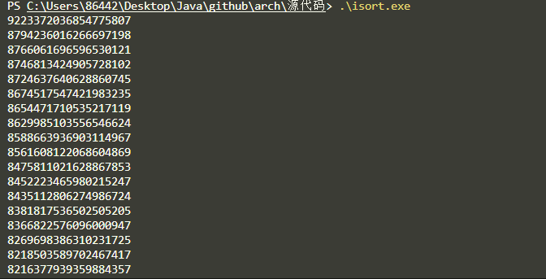
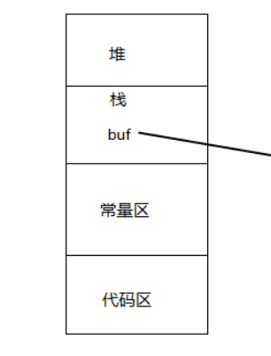
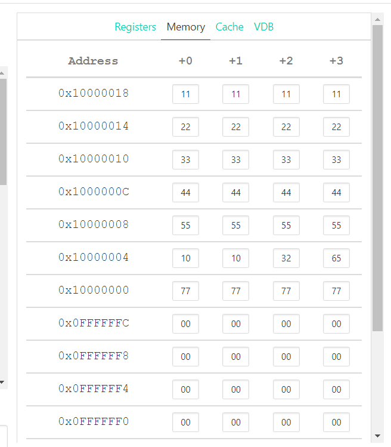
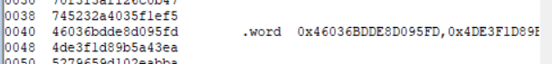

# 指令集实验报告

## isort.s程序分析

### 关键mips指令

1. `daddi reg1, reg2, imm` reg2加上一个立即数放入寄存器reg1

2. `slt reg1, reg2, reg3` 比较reg2的数据是否小于reg3, 如果小于, reg1置1, 否则置0

3. `beqz reg flag` 比较reg的数据是否等于0, 若等于则跳转到flag处

4. `j flag` 跳转到flag表示处的指令

### 程序逻辑

isort.s程序实现了`插入排序`, 逻辑为从数组第二个数字开始, 和之前的所有数字比较, 如果比`a[i]`小, 则后移一位, 否则将`a[i]`插入数组

## isort.s的C语言和x86汇编实现

### C语言实现

```c
#include <stdio.h>

int main(){
    int len = 100;
    long long unsigned int array[100] = { 100个64位数据};
    long long int cur;
    for(int i = 1; i< len;i++){
        cur = array[i];
        int j;
        for (j=i-1; j>= 0; j--){
            if (array[j] < cur){
                array[j+1] = array[j];  //元素后移
            }
            else{
                break;
            }
        }
        array[j+1] = cur;               //插入
    }
    for (int i =0;i< len;i++){
        printf("%lld\n", array[i]);
    }
    return 0;
}
```

### C语言实验截图



### C语言程序存储结构



### 汇编实现

#### 生成汇编语言指令:`gcc -S isort.C`

#### 汇编源代码
```asm
	.file	"isort.c"
	.text
	.def	__main;	.scl	2;	.type	32;	.endef
	.section .rdata,"dr"
.LC1:
	.ascii "%lld\12\0"
	.data
	.align 32
.LC0:
	.quad	5722212032175070361
	共100个64位数据
	.text
	.globl	main
	.def	main;	.scl	2;	.type	32;	.endef
	.seh_proc	main
main:
	pushq	%rbp
	.seh_pushreg	%rbp
	subq	$864, %rsp
	.seh_stackalloc	864
	leaq	128(%rsp), %rbp
	.seh_setframe	%rbp, 128
	.seh_endprologue
	call	__main
	movl	$100, 720(%rbp)
	leaq	-96(%rbp), %rax
	leaq	.LC0(%rip), %rdx
	movl	$800, %ecx
	movq	%rcx, %r8
	movq	%rax, %rcx
	call	memcpy
	movl	$1, 732(%rbp)
	jmp	.L2
.L8:
	movl	732(%rbp), %eax
	cltq
	movq	-96(%rbp,%rax,8), %rax
	movq	%rax, 712(%rbp)
	movl	732(%rbp), %eax
	subl	$1, %eax
	movl	%eax, 728(%rbp)
	jmp	.L3
.L7:
	movl	728(%rbp), %eax
	cltq
	movq	-96(%rbp,%rax,8), %rdx
	movq	712(%rbp), %rax
	cmpq	%rax, %rdx
	jnb	.L12
	movl	728(%rbp), %eax
	leal	1(%rax), %ecx
	movl	728(%rbp), %eax
	cltq
	movq	-96(%rbp,%rax,8), %rdx
	movslq	%ecx, %rax
	movq	%rdx, -96(%rbp,%rax,8)
	subl	$1, 728(%rbp)
.L3:
	cmpl	$0, 728(%rbp)
	jns	.L7
	jmp	.L6
.L12:
	nop
.L6:
	movl	728(%rbp), %eax
	addl	$1, %eax
	movq	712(%rbp), %rdx
	cltq
	movq	%rdx, -96(%rbp,%rax,8)
	addl	$1, 732(%rbp)
.L2:
	movl	732(%rbp), %eax
	cmpl	720(%rbp), %eax
	jl	.L8
	movl	$0, 724(%rbp)
	jmp	.L9
.L10:
	movl	724(%rbp), %eax
	cltq
	movq	-96(%rbp,%rax,8), %rax
	movq	%rax, %rdx
	leaq	.LC1(%rip), %rcx
	call	printf
	addl	$1, 724(%rbp)
.L9:
	movl	724(%rbp), %eax
	cmpl	720(%rbp), %eax
	jl	.L10
	movl	$0, %eax
	addq	$864, %rsp
	popq	%rbp
	ret
	.seh_endproc
	.ident	"GCC: (x86_64-posix-sjlj-rev0, Built by MinGW-W64 project) 8.1.0"
	.def	memcpy;	.scl	2;	.type	32;	.endef
	.def	printf;	.scl	2;	.type	32;	.endef

```

## RISC-V

### RISC-V汇编实现
```asm
.data
array: .word  0x65321010,0x11111111,0x00000000,0x22222222
       .word  0x44444444,0x55555555,0x77777777,0x33333333

len: .word 16

.text
        addi t0,zero,4
        addi x20,zero,2
        la x18,array
        la s6,len
        lw t1,0(s6)
        sll t1,t1,x20
for:    slt t2,t0,t1
        beqz t2,out
        add t3,zero,t0
        addi x18,x18,4
        lw t4,0(x18)
        addi x19,x18,0
loop:   slt t2,zero,t3
        beqz t2,over
        
        addi t5,t3,-4
        lw t6,-4(x19)
        
        slt t2,t6,t4
        beqz t2,over
        sw t6,0(x19)
        addi x19,x19,-4
        add t3,zero,t5
        
        j loop

over:   sw t4,0(x19)
        addi t0,t0,4
        j for
out:    ecall
```

#### RISC-V实验结果



## 指令集对比

### 汇编代码存储结构

#### 指令格式
MIPS指令是固定长度的，RISC-V和x86指令是变长的

#### 大小端编址方式
RISC-V和x86都是小端


mips为大端编址



## 实验心得

### 学会汇编语言的格式和语法

通过阅读mips排序的代码, 我熟悉了汇编条件分支, 循环控制, 以及数组, 存取地址的操作. 然后应用在编写RISC-V排序的过程中, 基本了解了汇编语言个格式和基本语法

### 理清程序的层次

通过本次实验我理清了从C语言代码 $\rightarrow$ 汇编程序  $\rightarrow$ 机器指令

