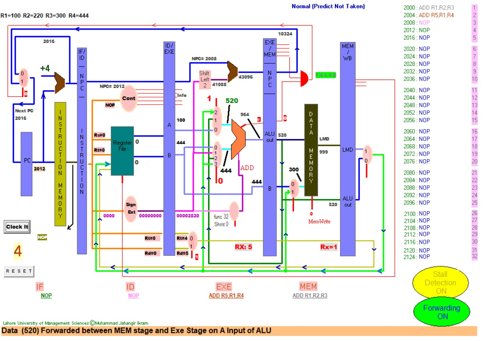
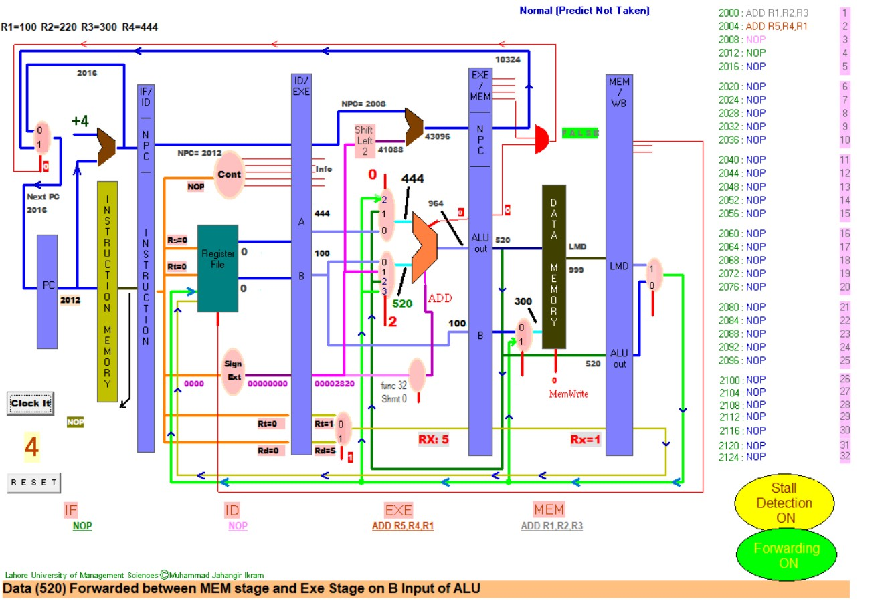
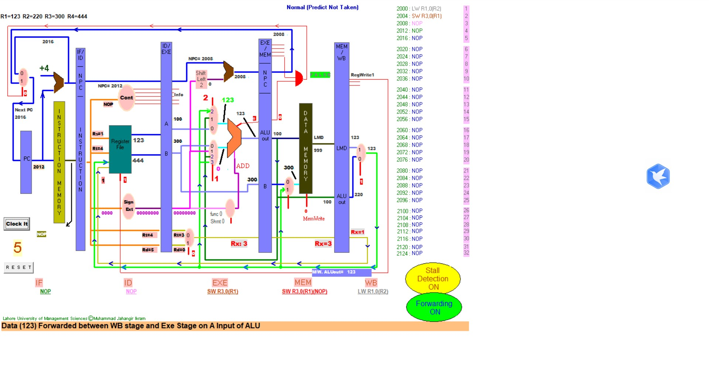
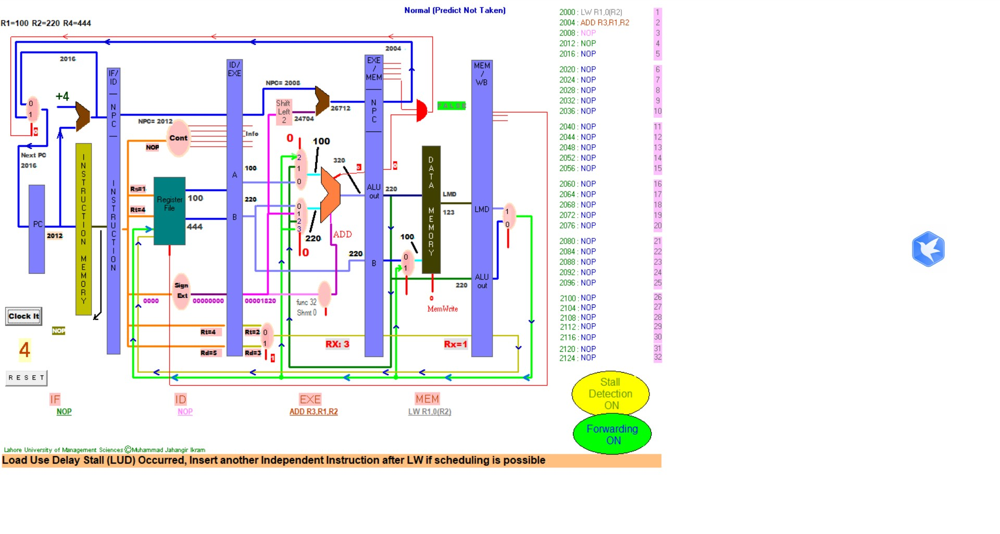
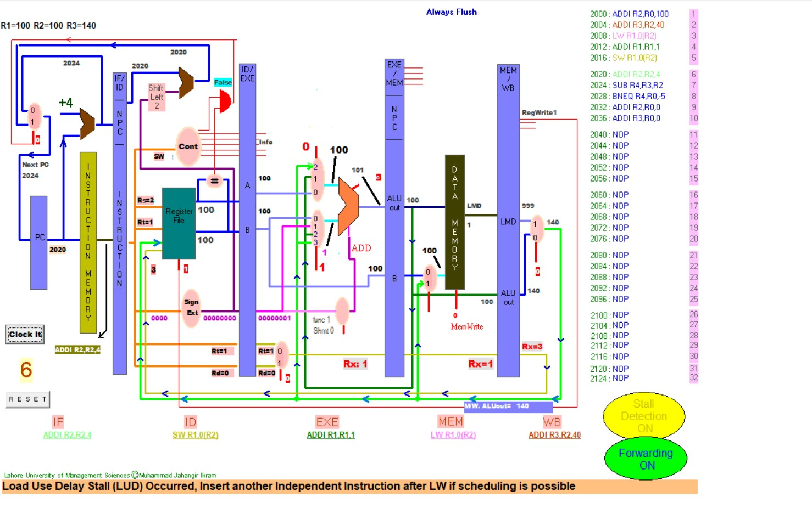
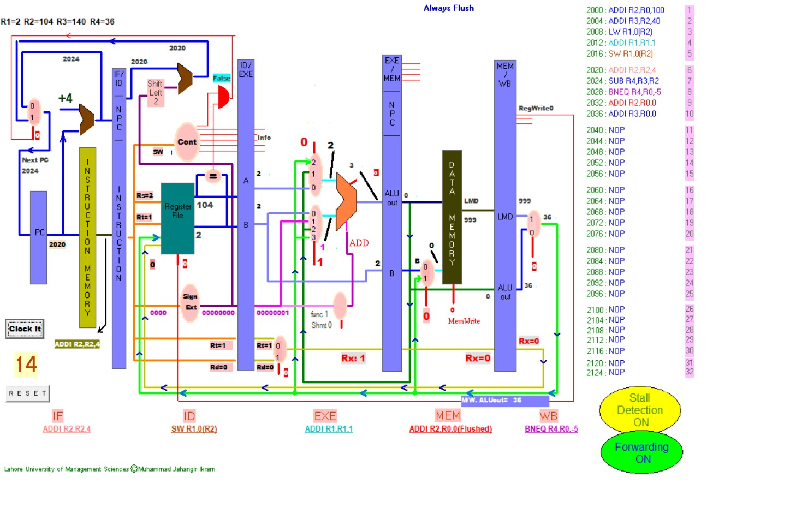

# 计算机体系结构Lab3

## 19281030-张云鹏

## Experiment1

### (a) forwards between EXE stage and MEM stage on upper of ALU

| Instruction  | 1   | 2   | 3   | 4                | 5   | 6   |
| ------------ | --- | --- | --- | ---------------- | --- | --- |
| ADD R1,R2,R3 | IF  | ID  | EXE | $\downarrow$MEM | WB  |     |
| ADD R5,R1,R4 |     | IF  | ID  | $\downarrow$EXE       | MEM | WB  |

### (b) forwards between EXE stage and WB stage on upper of ALU

| Instruction   | 1   | 2   | 3   | 4   | 5          | 6   | 7   |
| ------------- | --- | --- | --- | --- | ---------- | --- | --- |
| ADD R1, R2,R3 | IF  | ID  | EXE | MEM | $\downarrow$WB  |     |     |
| NOP           |     | IF  | ID  | EXE | $\downarrow$MEM | WB  |     |
| ADD R5,R1,R4  |     |     | IF  | ID  | $\downarrow$EXE | MEM | WB  |

### (c) forwards between EXE stage and MEM stage on lower of ALU

| Instruction   | 1   | 2   | 3   | 4          | 5   | 6   |
| ------------- | --- | --- | --- | ---------- | --- | --- |
| ADD R3, R1,R2 | IF  | ID  | EXE | $\downarrow$MEM | WB  |     |
| ADD R5,R4,R1  |     | IF  | ID  | $\downarrow$EXE | MEM | WB  |

### (d) forwards between EXE stage and WB stage on lower of ALU

| Instruction   | 1   | 2   | 3   | 4   | 5          | 6   | 7   |
| ------------- | --- | --- | --- | --- | ---------- | --- | --- |
| ADD R1, R2,R3 | IF  | ID  | EXE | MEM | $\downarrow$WB  |     |     |
| NOP           |     | IF  | ID  | EXE | $\downarrow$MEM | WB  |     |
| ADD R5,R4,R1  |     |     | IF  | ID  | $\downarrow$EXE | MEM | WB  |

### (d) forwards between WB stage and MEM stage

| Instruction  | 1   | 2   | 3   | 4   | 5          | 6   |
| ------------ | --- | --- | --- | --- | ---------- | --- |
| SW R1, 0(R2) | IF  | ID  | EXE | MEM | $\downarrow$WB  |     |
| LW R1, 0(R3) |     | IF  | ID  | EXE | $\downarrow$MEM | WB  |

### (f) Load Use Delay Stall 

| Instruction    | 1   | 2   | 3   | 4   | 5          | 6   | 6   |
| -------------- | --- | --- | --- | --- | ---------- | --- | --- |
| LW R1, 0(R2)   | IF  | ID  | EXE | MEM | $\downarrow$WB  |     |
| ADD R3, R1, R2 |     | IF  | ID  | ID  | $\downarrow$EXE | MEM | WB  |

## Experiment2

### (a) Theory analysis

- CPI: 1.07
- After BNEQ, trible ADD R0, R0, R0 instructions
- Predict NT: 循环完顺序执行
- Always Flush: 将剩下的Flush

### (b)
- offset=-6

#### (A) Total clock cycles=18

| Instruction    | 1   | 2   | 3   | 4   | 5   | 6   | 7   | 8   | 9   | 10  | 11  | 12  | 13  | 14  | 15  | 16  | 17  | 18  | 19  | 20  | 21  | 22  | 23  | 24  | 25  | 26  | 27  | 28  | 29  |
| -------------- | --- | --- | --- | --- | --- | --- | --- | --- | --- | --- | --- | --- | --- | --- | --- | --- | --- | --- | --- | --- | --- | --- | --- | --- | --- | --- | --- | --- | --- |
| LW R1,0(R2)    | IF  | ID  | EXE | MEM | WB  |     |     |     |     |     |     |     |     |     |     | IF  | ID  | EXE | MEM | WB  |     |     |     |     |     |
| ADD R1,R1,#1   |     | IF  | ID  | ID  | ID  | EXE | MEM | WB  |     |     |     |     |     |     |     |     | IF  | ID  | ID  | ID  | EXE | MEM | WB  |     |     |
| SW R1,0(R2)    |     |     | IF  | IF  | IF  | ID  | ID  | ID  | EXE | MEM | WB  |     |     |     |     |     |     | IF  | IF  | IF  | ID  | ID  | ID  | EXE | MEM |
| ADDI R2,R2,#4  |     |     |     |     |     | IF  | IF  | IF  | ID  | EXE | MEM | WB  |     |     |     |     |     |     |     |     | IF  | IF  | IF  | ID  | EXE |
| DSUB R4,R3,R2  |     |     |     |     |     |     |     |     | IF  | ID  | ID  | ID  | EXE | MEM | WB  |     |     |     |     |     |     |     |     | IF  | ID  |
| BNEZ R4, Loop1 |     |     |     |     |     |     |     |     |     | IF  | IF  | IF  | ID  | ID  | ID  | EXE | MEM | WB  |     |     |     |     |     |     | IF  |

#### (B) Total clock cycles=12

| Instruction    | 1   | 2   | 3   | 4   | 5   | 6   | 7   | 8   | 9   | 10  | 11  | 12  |
| -------------- | --- | --- | --- | --- | --- | --- | --- | --- | --- | --- | --- | --- |
| LW R1,0(R2)    | IF  | ID  | EXE | MEM | WB  |     |     |     |     | IF  | ID  | EXE |
| ADD R1,R1,#1   |     | IF  | ID  | EXE | EXE | MEM | WB  |     |     |     | IF  | ID  |
| SW R1,0(R2)    |     |     | IF  | ID  | ID  | EXE | MEM | WB  |     |     |     | IF  |
| ADDI R2,R2,#4  |     |     |     | IF  | IF  | ID  | EXE | MEM | WB  |     |     |     |
| DSUB R4,R3,R2  |     |     |     |     |     | IF  | ID  | EXE | MEM | WB  |     |     |
| BNEZ R4, Loop1 |     |     |     |     |     |     | IF  | ID  | ID  | EXE | MEM | WB  |

## 实验感悟

- 流水线各种技术诞生的根源: 指令之间的依赖.
- forwarding技术: 提供了指令内容之间通信的途径
- branching相关技术: 解决了指令是否应该执行的问题.