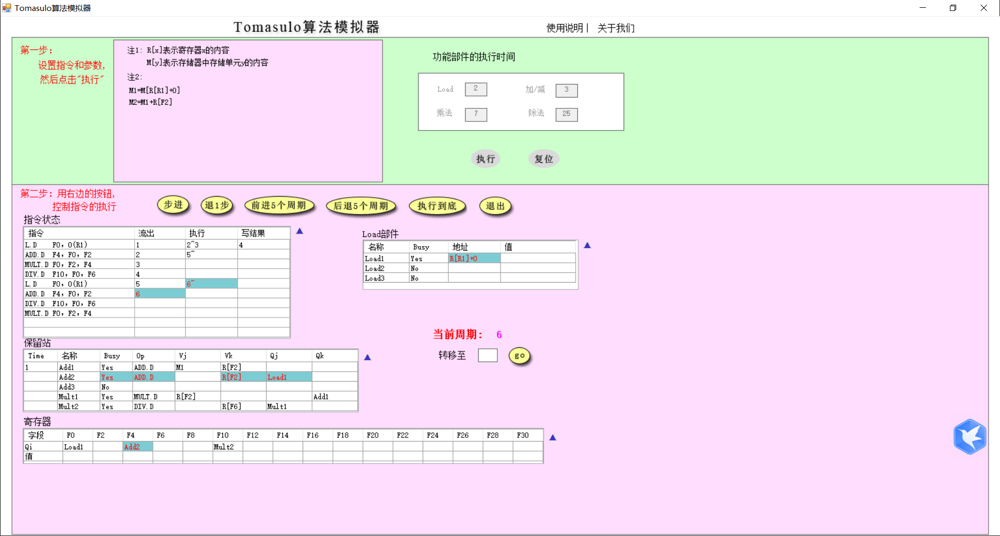
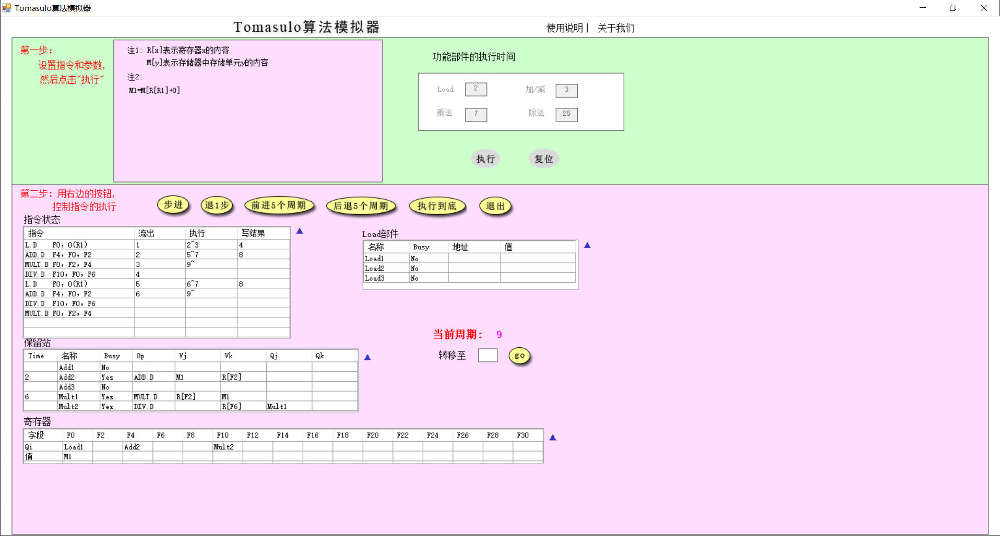

# 计算机体系结构lab4

## 19281030-张云鹏

## Tomasulo算法

### 输入指令程序, 配置指令耗时

### 指令执行周期跟踪

1. `Cycle 1` 
   - 取出第一条指令`L.D F0, 0(R1)`
   - `Load1`设为Busy
   - `Load1`名存入F0 

2. `Cycle 2` 
   - 取出第二条指令 `ADD.D F4, F0, F2`
   - `Qj`存入`Load1`
   - `Add1`设为Busy
   - `Add1`名存入 `F4`
   - `L.D`指令执行

3. `Cycle 3`
    - `Load`指令执行完毕
    - 取出第三条指令 `MULT.D F0, F2, F4`
    - Mult1.Busy=Yes
    - F0.Qi=Mult1
    - Mult1.Qk=Add1

4. Cycle 4
    - Load1 Write Result 
    - Load1.Busy =No
    - Add1.Vj=M1
    - Fetch 4th instruction
    - Mult2.Busy = Yes 
    - Mult2.Qj = Mult1

5. Cycle 5
    - 2nd instruction start to execute 
    - fetch 5th instruction 
    - Load1.Busy = Yes
    - F0.Qi = Load1

6. Cycle 6
    - Load1 start to execute
    - Fetch 6th instruction
    - Add2.Busy = Yes 
    - Add2.Qj = Load1

7. Cycle 7
    - 2nd and 5th instruction complete
  

8. Cycle 8
    - 2nd and 5th instruction write result 
    - F0.Value = M1
    - Add2.Vj = M1
    - Mult1.Vk = M1

9. Cycle 9
    - Mult2 and Add2 start to execute
  

10. Skip Cycle 10
11. Cycle 11
    - Add2 Complete
  

12. Cycle 12
    - 6th write to F4
    - F4.Value = M2
    - Add2.Busy = No

13. Cycle 13 skip
14. Cycle 14 skip
15. Cycle 15 skip
16. Cycle 16
    - 3rd instruction write to F10
    - Fetch 7th instruction
    - F10.Qi = Mult1
    - Mult2.Vj = M3

17. Cycle 17
    - 4th and 7th instruction start to execute

18. Cycle 18 ~ Cycle 41 skip
19. Cycle 42
    - 4th and 7th instruction write results
    - F10.Value = M3
    - Fetch 8th instruction
    - F0.Qi = Mult1
20. Cycle 43 ~ Cycle 49 skip
21. Cycle 50
    - 8th write to F0
    - F0.Value = M4

### Tomasulo 原理分析
#### RAW(写后读):
1. L.D F0, (0)R1
2. ADD.D F1, F0

Tomasulo算法会先将Load后面依赖F0的, 使用Load1. 相当于通过保留站的表映射, 缓存依赖关系, 等到数据准备好之后通过CDB broadcast, 所以后面的指令无需等待停顿, 从而提高了效率.

#### WAR(读后写)
1. ADD.D F2, F1
2. L.D F1, (0)R1
   
Tomasulo重命名读的寄存器为Load1, 之前的Add1并不会受到影响.

#### WAW(写后写)
1. L.D F1, (0)R1
2. L.D F1, (0)R2
Tomasulo流出后即进行写预约, 后面的可以覆盖前面的, 所以保证最后结果是最后的输出