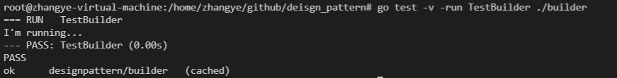

## 测试命令

`cd builder && go test -v`
## 实验结果


## 环境要求

`go1.13+`

## 接口设计

```go
type ICarBuilder interface {
	BuildTyre()
	BuildSteerWheel()
	BuildMotor()
	Build() Car
}
```
抽象建造者

```go
type BMWBuilder struct {
	Car
}
```
具体建造者

## 接口实现
```go
func (bmwbuilder BMWBuilder) BuildTyre() {
	bmwbuilder.Car.Tyre = "BMW Tyre"
}
func (bmwbuilder BMWBuilder) BuildSteerWheel() {
	bmwbuilder.Car.SteerWheel = "BMW SteerWheel"
}
func (bmwbuilder BMWBuilder) BuildMotor() {
	bmwbuilder.Car.Motor = "BMW Motor"
}
```
具体建造者实现接口

```go
func (bmwbuilder BMWBuilder) Build() Car{
	return bmwbuilder.Car
}
```
`Build()`方法生产产品