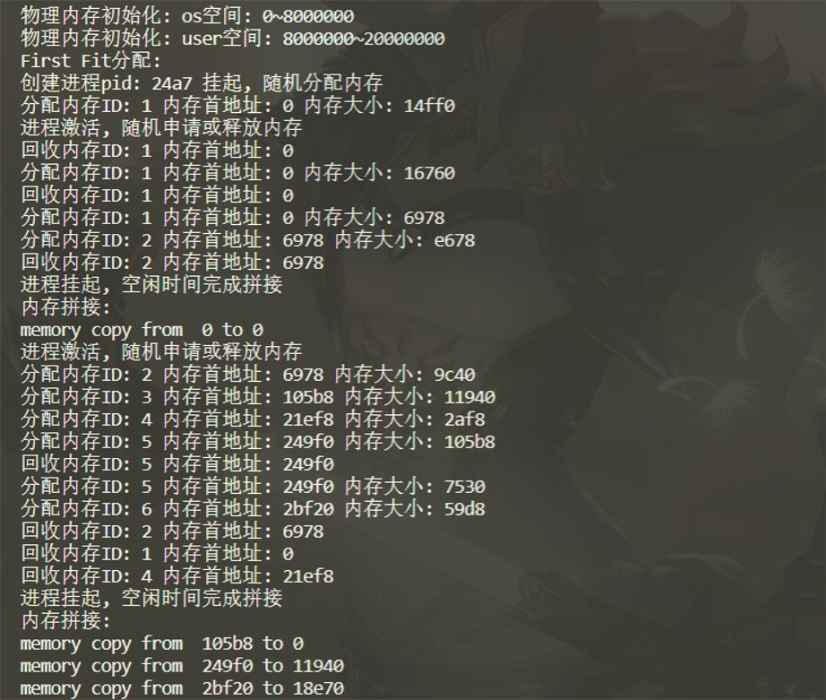

# 动态可重定位分区内存管理模拟设计与实现
## 19281030-张云鹏
## 实验截图

## 数据结构设计
### 内存表
```C++
class MemTab
{
public:
    std::vector<MemTabItem> mem_tab_items;       //数据项
    uintptr_t mem_tab_min;                       //最低地址
    uintptr_t mem_tab_max;                       //最高地址
    virtual int memory_alloc(uint memory_size);  //内存分配函数
    void memory_recycle(uint memory_item_index); //内存回收函数
    void memory_degap();                         //内存拼接函数
};
```
### 内存块
```C++
class MemTabItem
{
public:
    int mem_tab_item_ID;   //内存块ID
    uintptr_t begin_ptr;   //内存块起始地址
    int mem_tab_item_size; //内存块大小
};
```
### 内存控制器
```C++
class Controller
{
public:
    MemTab *os_memory_tab;          //内核空间内存表
    MemTab *user_memory_tab;        //用户空间内存表
    void init_memory();             //物理空间初始化
    void handle_process_create();   //处理进程创建事件
    void handle_process_sleep();    //处理进程休眠事件
    void handle_process_activate(); //处理进程激活事件
};
```

## 物理内存空间布局初始化

- 物理内存空间共分为两大部分, 内核空间与用户空间. 分别占用低地址128MB, 高地址384MB;
- 初始化时单位统一为`B(Byte)`, 地址打印格式为16进制;
```C++
void Controller::init_memory()
{
    //设置内核空间与用户空间范围
    this->os_memory_tab->mem_tab_min = 0;
    this->os_memory_tab->mem_tab_max = 128 * pow(2, 20);
    this->user_memory_tab->mem_tab_min = 128 * pow(2, 20);
    this->user_memory_tab->mem_tab_max = 512 * pow(2, 20);
    //此处省略输出代码等
}
```

## 内存分配算法
### First Fit 内存分配算法
整体思路: 遍历内存表, 插入第一个空间足够的内存块.
``` C++
// First Fit 内存分配算法
class MemTabFirstFit : public MemTab
{
public:
    int memory_alloc(uint memory_size);
};
int MemTabFirstFit::memory_alloc(uint memory_size)
{
    for (int i = 0; i < this->mem_tab_items.size(); i++) //遍历内存表
    {
        if (i == mem_tab_items.size() - 1) //最后一项
        {
            if (mem_tab_items[i].begin_ptr + memory_size <= this->mem_tab_max) //是否超出用户区
            {
                MemTabItem new_mem_tab_item; //创建新内存表项
                //此处省略内存块初始化与打印代码
                return i + 1;
            }
        }
        else
        {
            if (mem_tab_items[i].begin_ptr + mem_tab_items[i].mem_tab_item_size + memory_size <= mem_tab_items[i + 1].begin_ptr)// 是否超出下个内存块的首地址
            { 
                //此处省略内存块初始化与打印代码
                return i + 1;
            }
        }
    }
    return -1;
}
```
### Worst Fit内存分配算法
整体思路: 遍历所有的内存表项, 插入空间最大的内存块.
```C++
// Worst Fit 内存分配算法
class MemTabWorstFit : public MemTab
{
public:
    int memory_alloc(uint memory_size);
};
int MemTabWorstFit::memory_alloc(uint memory_size)
{
    int cur_space = -1;    //当前空间大小
    int cur_position = -1; //最大的可插入位置
    for (int i = 0; i < this->mem_tab_items.size(); i++)
    {
        if (i == mem_tab_items.size() - 1) //是否为最后一项
        {
            int space_after_i = mem_tab_max - mem_tab_items[i].begin_ptr;
            if (space_after_i <= memory_size && space_after_i > cur_space) //当前空间更大则变更插入位置
            {
                cur_position = i;
            }
        }
        else
        {
            int space_after_i = mem_tab_items[i + 1].begin_ptr - mem_tab_items[i].begin_ptr;
            if (memory_size <= space_after_i && space_after_i > cur_space)
            { // 是否超出下个内存块的首地址
                cur_position = i;
            }
        }
    }
    if (cur_position != -1)
    {
        //此处省略内存块初始化与打印代码
        return cur_position + 1;
    }
    return -1;
}
```

## 内存拼接处理
整体思路: 遍历内存表项, 将首地址移到到前一个内存块的末尾, 同时调用内存拷贝函数

```C++
//内存拼接
void MemTab::memory_degap()
{
    cout << "内存拼接: " << endl; //遍历内存表, copy memory
    for (int i = 0; i < this->mem_tab_items.size() - 1; i++)
    {
        cout << "memory copy from  " << mem_tab_items[i + 1].begin_ptr;
        mem_tab_items[i + 1].begin_ptr = mem_tab_items[i].begin_ptr + mem_tab_items[i].mem_tab_item_size;
        cout << " to " << mem_tab_items[i].begin_ptr + mem_tab_items[i].mem_tab_item_size << endl;
    }
}
```

## 进程事件处理
### 进程创建
进程创建时挂起, 随机分配内存大小模拟真实场景.
```C++
void Controller::handle_process_create()
{
    cout << "创建进程pid: " << rand() % 10000 << " 挂起, 随机分配内存" << endl;
    this->user_memory_tab->memory_alloc(rand() % 100 * 1000);
    //此处省略内核挂起进程代码
}
```
### 进程激活
进程激活后, 随机申请或回收内存模拟真实场景.
```C++
void Controller::handle_process_activate()
{
    cout << "进程激活, 随机申请或释放内存" << endl;
    for (int i = 0; i < 10; i++) //随机10次
    {
        int x = rand();
        if (x % 2 == 0)
        {
            this->user_memory_tab->memory_alloc(rand() % 100 * 1000);
        }
        else if (this->user_memory_tab->mem_tab_items.size() > 1)
        {
            int y = x % (this->user_memory_tab->mem_tab_items.size() - 1);
            this->user_memory_tab->memory_recycle(y + 1);
        }
    }
}
```

### 进程挂起
进程挂起后空闲时间内存拼接, 提高空间利用率
```C++
void Controller::handle_process_sleep()
{
    cout << "进程挂起, 空闲时间完成拼接" << endl;
    this->user_memory_tab->memory_degap();
}
```

## 内存回收
根据内存块ID回收内存, 更新内存表.
```C++
//输入需回收内存表索引
void MemTab::memory_recycle(uint memory_item_index)
{
    if (memory_item_index == 0)
    {
        cout << "0 内存不允许回收" << endl; //保证数据表不为空, 以免引发指针错误
    }
    MemTabItem new_mem_tab_item = mem_tab_items[memory_item_index];
    cout << "回收内存ID: " << new_mem_tab_item.mem_tab_item_ID << " 内存首地址: " << new_mem_tab_item.begin_ptr << endl;
    mem_tab_items.erase(mem_tab_items.begin() + memory_item_index);
}
```

## 性能指标分析
### 平均内存利用率
整体思路: 
1. 创建子线程
2. 每秒统计一次当前的内存利用率, 并保存
3. main函数执行完毕前, 将保存的利用率取平均值.
```C++
//统计平均内存利用率
double statics_mem_utilization_rate(Controller controller)
{
    double mem_utilization_rate_average = 0; //平均内存利用率
    vector<double> mem_utilization_rates;    //一秒内内存利用率数组
    //每秒计算一次内存利用率, 然后求平均值.
    while (true)
    {
        vector<MemTabItem> mem_tab_items = controller.user_memory_tab->mem_tab_items;
        int sum = 0;
        //遍历内存表, 求利用内存和
        for (int i = 0; i < mem_tab_items.size(); i++)
        {
            sum += mem_tab_items[i].mem_tab_item_size;
        }
        //求当前内存利用率
        double mem_utilization_rate = sum / (512 - 128) * pow(2, 20);
        mem_utilization_rates.push_back(mem_utilization_rate);
        //休眠1秒
        sleep(1);
    }
    //求内存利用率平均值
    double rates_sum = 0;
    for (int i = 0; i < mem_utilization_rates.size(); i++)
    {
        rates_sum += mem_utilization_rates[i];
    }
    return rates_sum / mem_utilization_rates.size();
}
```
