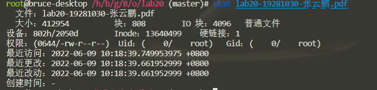
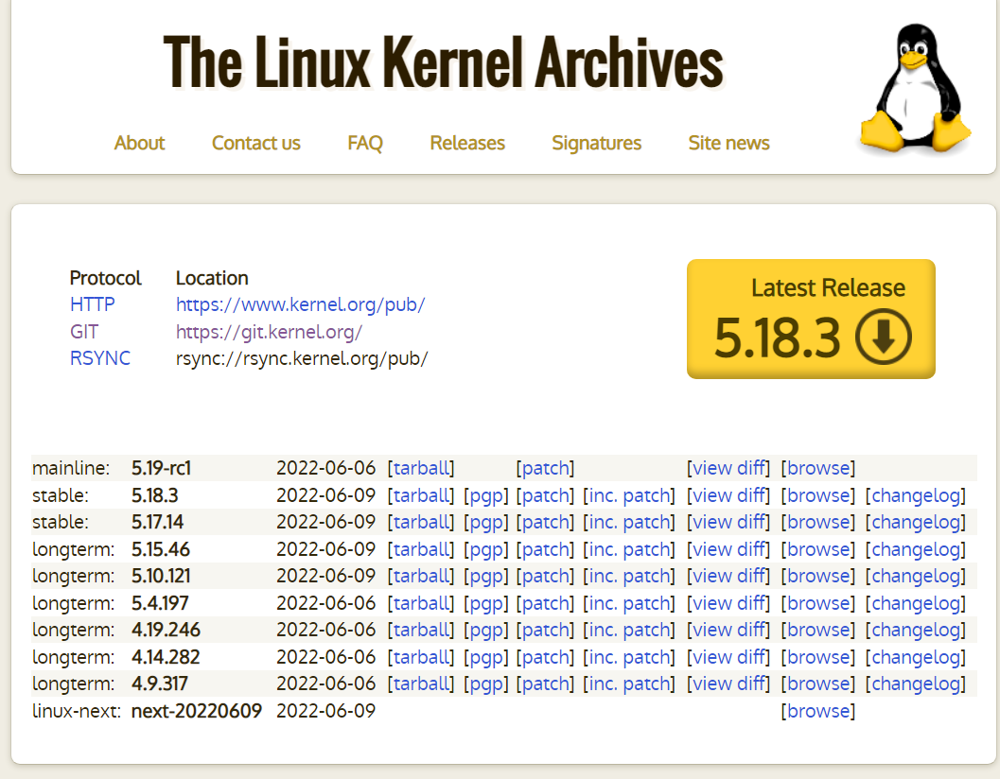
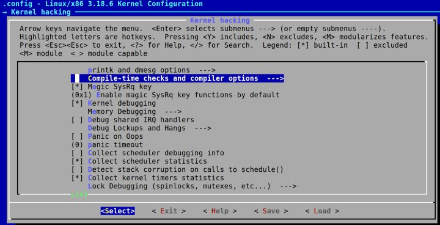

# Linux 特定文件系统设计探析
## 19281030-张云鹏
## 实验截图


## 实验环境
- Ubuntu20.04 LTS

## Linux源码分析
### 内核源码下载

下载内核最新版本源码



```shell
wget https://cdn.kernel.org/pub/linux/kernel/v5.x/linux-5.18.3.tar.xz
```

### 解压源码
```shell
xz -d linux-5.18.3.tar.xz
tar xvf linux-5.18.3.tar
```
### 编译源码
```shell
cd linux-5.18.3
make i386_defconfig
cd ~/19281030zyp/    $设置文件系统根目录
mkdir rootfs
cd menu
gcc -o init linktable.c menu.c test.c -m32 -static –lpthread
cd ../rootfs
cp ../menu/init ./
find . | cpio -o -H newc |gzip -9 > ../rootfs.img
```


### 源码分析
#### 进程与文件系统

```C
truct task_struct {
	……
	/* filesystem information */
	struct fs_struct *fs;
	/* open file information */
	struct files_struct *files;
	/* namespaces */
	struct nsproxy *nsproxy;
	……
}
```

- fs成员指向进程当前工作目录的文件系统信息。files成员指向了进程打开的文件的信息。nsproxy指向了进程所在的命名空间，其中包含了虚拟文件系统命名空间。

- fs中包含了文件系统的挂载点和挂载点的dentry信息。而files指向了一系列的struct file结构，其中struct path结构用于将struct file和vfsmount以及dentry联系起来。struct file保存了内核所看到的文件的特征信息，进程打开的文件列表就存放在task_struct->files->fd_array[]数组以及fdtable中。

- task_struct结构还存放了其打开文件的文件描述符fd的信息，这是用户进程需要用到的，用户进程在通过文件名打开一个文件后，文件名就没有用处了，之后的操作都是对文件描述符fd的，在内核中，fget_light()函数用于通过整数fd来查找对应的struct file对象。由于每个进程都维护了自己的fd列表，所以不同进程维护的fd的值可以重复，例如标准输入、标准输出和标准错误对应的fd分别为0、1、2
- struct file的mapping成员指向属于文件相关的inode实例的地址空间映射，通常它设置为inode->i_mapping。在读写一个文件时，每次都从物理设备上获取文件的话，速度会很慢，在内核中对每个文件分配一个地址空间，实际上是这个文件的数据缓存区域，在读写文件时只是操作这块缓存，通过内核有相应的同步机制将脏的页写回物理设备。super_block中维护了一个脏的inode的链表。

```C
struct file_operations {
	struct module *owner;
	loff_t (*llseek) (struct file *, loff_t, int);
	ssize_t (*read) (struct file *, char __user *, size_t, loff_t *);
	ssize_t (*write) (struct file *, const char __user *, size_t, loff_t *);
	ssize_t (*aio_read) (struct kiocb *, const struct iovec *, unsigned long, loff_t);
	ssize_t (*aio_write) (struct kiocb *, const struct iovec *, unsigned long, loff_t);
	int (*readdir) (struct file *, void *, filldir_t);
	unsigned int (*poll) (struct file *, struct poll_table_struct *);
	int (*ioctl) (struct inode *, struct file *, unsigned int, unsigned long);
	long (*unlocked_ioctl) (struct file *, unsigned int, unsigned long);
	long (*compat_ioctl) (struct file *, unsigned int, unsigned long);
	int (*mmap) (struct file *, struct vm_area_struct *);
	int (*open) (struct inode *, struct file *);
	int (*flush) (struct file *, fl_owner_t id);
	int (*release) (struct inode *, struct file *);
	int (*fsync) (struct file *, struct dentry *, int datasync);
	……
};
```

#### 文件系统打包

在制作好了文件系统的目录之后，可通过特定于文件系统类型的工具对目录进行打包，即制作文件系统。例如squashfs文件系统的打包工具为mksquashfs。除了打包之外，打包工具还针对特定文件系统生成超级块和inode节点信息，最终生成的文件系统镜像可以被内核解释并挂载。

#### VFS相关数据结构

```C
struct inode {
	/* 全局的散列表 */
	struct hlist_node	i_hash;
	/* 根据inode的状态可能处理不同的链表中（inode_unused/inode_in_use/super_block->dirty） */
	struct list_head	i_list;
	/* super_block->s_inodes链表的节点 */
	struct list_head	i_sb_list;
	/* inode对应的dentry链表，可能多个dentry指向同一个文件 */
	struct list_head	i_dentry;
	/* inode编号 */
	unsigned long		i_ino;
	/* 访问该inode的进程数目 */
	atomic_t		i_count;
	/* inode的硬链接数 */
	unsigned int		i_nlink;
	uid_t			i_uid;
	gid_t			i_gid;
	/* inode表示设备文件时的设备号 */
	dev_t			i_rdev;
	u64			i_version;
	/* 文件的大小，以字节为单位 */
	loff_t			i_size;
#ifdef __NEED_I_SIZE_ORDERED
	seqcount_t		i_size_seqcount;
#endif
	/* 最后访问时间 */
	struct timespec		i_atime;
	/* 最后修改inode数据的时间 */
	struct timespec		i_mtime;
	/* 最后修改inode自身的时间 */
	struct timespec		i_ctime;
	/* 以block为单位的inode的大小 */
	blkcnt_t		i_blocks;
	unsigned int		i_blkbits;
	unsigned short          i_bytes;
	/* 文件属性，低12位为文件访问权限，同chmod参数含义，其余位为文件类型，如普通文件、目录、socket、设备文件等 */
	umode_t			i_mode;
	spinlock_t		i_lock;	/* i_blocks, i_bytes, maybe i_size */
	struct mutex		i_mutex;
	struct rw_semaphore	i_alloc_sem;
	/* inode操作 */
	const struct inode_operations	*i_op;
	/* file操作 */
	const struct file_operations	*i_fop;
	/* inode所属的super_block */
	struct super_block	*i_sb;
	struct file_lock	*i_flock;
	/* inode的地址空间映射 */
	struct address_space	*i_mapping;
	struct address_space	i_data;
#ifdef CONFIG_QUOTA
	struct dquot		*i_dquot[MAXQUOTAS];
#endif
	struct list_head	i_devices; /* 若为设备文件的inode，则为设备的打开文件列表节点 */
	union {
		struct pipe_inode_info	*i_pipe;
		struct block_device	*i_bdev; /* 若为块设备的inode，则指向该设备实例 */
		struct cdev		*i_cdev; /* 若为字符设备的inode，则指向该设备实例 */
	};
	__u32			i_generation;
#ifdef CONFIG_FSNOTIFY
	__u32			i_fsnotify_mask; /* all events this inode cares about */
	struct hlist_head	i_fsnotify_mark_entries; /* fsnotify mark entries */
#endif
#ifdef CONFIG_INOTIFY
	struct list_head	inotify_watches; /* watches on this inode */
	struct mutex		inotify_mutex;	/* protects the watches list */
#endif
	unsigned long		i_state;
	unsigned long		dirtied_when;	/* jiffies of first dirtying */
	unsigned int		i_flags; /* 文件打开标记，如noatime */
	atomic_t		i_writecount;
#ifdef CONFIG_SECURITY
	void			*i_security;
#endif
#ifdef CONFIG_FS_POSIX_ACL
	struct posix_acl	*i_acl;
	struct posix_acl	*i_default_acl;
#endif
	void			*i_private; /* fs or device private pointer */
};
```
#### super_block

```C

super_block {
	/* 全局链表元素 */
	struct list_head	s_list;
	/* 底层文件系统所在的设备 */
	dev_t			s_dev;
	/* 文件系统中每一块的长度 */
	unsigned long		s_blocksize;
	/* 文件系统中每一块的长度（以2为底的对数） */
	unsigned char		s_blocksize_bits;
	/* 是否需要向磁盘回写 */
	unsigned char		s_dirt;
	unsigned long long	s_maxbytes;	/* Max file size */
	/* 文件系统类型 */
	struct file_system_type	*s_type;
	/* 超级块操作方法 */
	const struct super_operations	*s_op;
	struct dquot_operations	*dq_op;
 	struct quotactl_ops	*s_qcop;
	const struct export_operations *s_export_op;
	unsigned long		s_flags;
	unsigned long		s_magic;
	/* 全局根目录的dentry */
	struct dentry		*s_root;
	struct rw_semaphore	s_umount;
	struct mutex		s_lock;
	int			s_count;
	int			s_need_sync;
	atomic_t		s_active;
#ifdef CONFIG_SECURITY
	void                    *s_security;
#endif
	struct xattr_handler	**s_xattr;
	/* 超级块管理的所有inode的链表 */
	struct list_head	s_inodes;	/* all inodes */
	/* 脏的inode的链表 */
	struct list_head	s_dirty;	/* dirty inodes */
	struct list_head	s_io;		/* parked for writeback */
	struct list_head	s_more_io;	/* parked for more writeback */
	struct hlist_head	s_anon;		/* anonymous dentries for (nfs) exporting */
	/* file结构的链表，该超级块上所有打开的文件 */
	struct list_head	s_files;
	/* s_dentry_lru and s_nr_dentry_unused are protected by dcache_lock */
	/* 不再使用的dentry的LRU链表 */
	struct list_head	s_dentry_lru;	/* unused dentry lru */
	int			s_nr_dentry_unused;	/* # of dentry on lru */
	struct block_device	*s_bdev;
	struct mtd_info		*s_mtd;
	/* 相同文件系统类型的超级块链表的节点 */
	struct list_head	s_instances;
	struct quota_info	s_dquot;	/* Diskquota specific options */
	int			s_frozen;
	wait_queue_head_t	s_wait_unfrozen;
	char s_id[32];				/* Informational name */
	void 			*s_fs_info;	/* Filesystem private info */
	fmode_t			s_mode;
	/*
	 * The next field is for VFS *only*. No filesystems have any business
	 * even looking at it. You had been warned.
	 */
	struct mutex s_vfs_rename_mutex;	/* Kludge */
	/* Granularity of c/m/atime in ns.
	   Cannot be worse than a second */
	u32		   s_time_gran;
	/*
	 * Filesystem subtype.  If non-empty the filesystem type field
	 * in /proc/mounts will be "type.subtype"
	 */
	char *s_subtype;
	/*
	 * Saved mount options for lazy filesystems using
	 * generic_show_options()
	 */
	char *s_options;
};
dentry：
struct dentry {
	atomic_t d_count;
	unsigned int d_flags;		/* protected by d_lock */
	spinlock_t d_lock;		/* per dentry lock */
	/* 该dentry是否是一个装载点 */
	int d_mounted;
	/* 文件所属的inode */
	struct inode *d_inode;
	/*
	 * The next three fields are touched by __d_lookup.  Place them here so they all fit in a cache line.
	 */
	/* 全局的dentry散列表 */
	struct hlist_node d_hash;	/* lookup hash list */
	/* 父目录的dentry */
	struct dentry *d_parent;	/* parent directory */
	/* 文件的名称，例如对/tmp/a.sh，文件名即为a.sh */
	struct qstr d_name;
	/* 脏的dentry链表的节点 */
	struct list_head d_lru;		/* LRU list */
	/*
	 * d_child and d_rcu can share memory
	 */
	union {
		struct list_head d_child;	/* child of parent list */
	 	struct rcu_head d_rcu;
	} d_u;
	/* 该dentry子目录中的dentry的节点链表 */
	struct list_head d_subdirs;	/* our children */
	/* 硬链接使用几个不同名称表示同一个文件时，用于连接各个dentry */
	struct list_head d_alias;	/* inode alias list */
	unsigned long d_time;		/* used by d_revalidate */
	const struct dentry_operations *d_op;
	/* 所属的super_block */
	struct super_block *d_sb;	/* The root of the dentry tree */
	void *d_fsdata;			/* fs-specific data */
	/* 如果文件名由少量字符组成，在保存在这里，加速访问 */
	unsigned char d_iname[DNAME_INLINE_LEN_MIN];	/* small names */
};
```

### 文件系统测试与验证

测试命令
```shell
stat lab20-19281030-张云鹏.pdf
```
