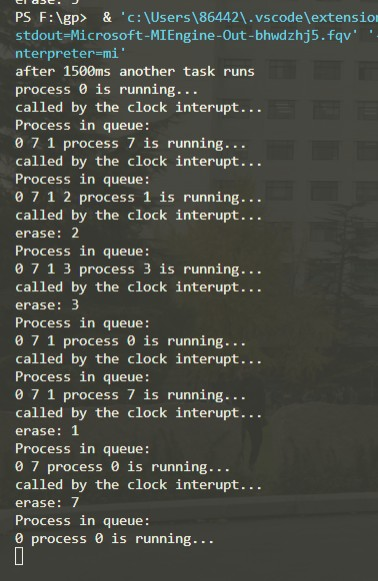
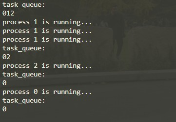
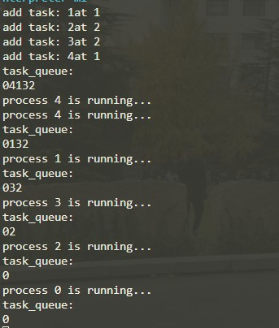

# 处理器调度算法模拟实现与比较实验报告
## 19281030-张云鹏
## 实验截图

### 时间片轮转调度算法 


### 先来先调度算法


### 短进程优先调度算法


## 实验环境
- Windows 10 v19044.1645
- gcc version 8.1.0 (x86_64-posix-sjlj-rev0)

## 测试命令
```shell
g++ schedule.cpp && ./a.exe
```

## 数据结构设计
### 进程数据结构
```C++
class ITask{
public:
    virtual void run()=0;    //线程调用
    virtual void stop()=0;   //结束通知调度器
    int pid;                 //pid标识进程
};
//进程接口, 可由进程或线程实现

class Process: public ITask{
public:
    void run();
    void stop();
};
//真实进程
```
### 调度器基类数据结构
```C++
class ISchedule
{
public:
    virtual void inter_call() = 0;        //时钟中断信号处理程序
    virtual void call(ITask *task) = 0;   //调用进程
    virtual void schedule_task() = 0;     //调度逻辑
};                                        
//调度器接口

class ScheduleWithTaskList : public Schedule
{
public:
    vector<ITask *> task_queue;                      //线程队列
    vector<ITask *>::iterator it;                    //迭代器指向当前运行的程序
    void add_task(ITask *task);                      //添加线程到队列
    void remove_task(vector<ITask *>::iterator &it); //移除运行完毕的线程
    void show_task_queue();                          //打印当前队列
};
//增加线程队列


```

## 时间片轮转调度算法
### 数据结构
```C++
class ScheduleTimeSlice : public ScheduleWithTaskList
{
public:
    void call();
    void schedule_task();
    void set_clock(int time);//设定时钟中断周期
};
```
### 进程调度逻辑
1. 设定时钟周期, 
2. 生成守护idle闲置进程, 永不退出队列
3. 遍历线程队列 
4. 每次调用进程结束后随机生成新进程添加至线程队列
5. 每次调用进程结束后随机结束当前进程
```C++
void ScheduleTimeSlice::schedule_task()
{
    this->set_clock(TIME_SLICE / 10000); //设定时钟周期
    while (true)
    {
        this->call();              //调用线程
        sleep(TIME_SLICE / 10000); //模拟进程耗时

        this->inter_call();
        if (rand() % 2 == 0)
        {
            Process *px;
            px = new Process;
            this->add_task(px); // 50%概率添加线程
        }
        if (rand() % 2 == 0 && ((Process *)*(this->it))->pid != 0)
        {
            this->remove_task(this->it); // 50%概率移除当前进程, 同时不会移除idle进程
        }

        this->show_task_queue(); //打印进程队列
    }
}
```
##  先来先服务调度算法
### 数据结构
```C++
class ScheduleComeFirst : public ScheduleWithTaskList
{
public:
    void schedule_task();       //overide 调度逻辑
    void add_task(ITask* task); //overide 添加队列
};
```

### 进程调度逻辑

1. 生成守护idle闲置进程, 永不退出队列
2. 顺序执行线程队列
3. 执行完毕后删除线程
4. 每次调用进程结束后随机生成新进程添加至线程队列
5. 每次调用进程结束后随机结束当前进程

```C++
void ScheduleComeFirst::schedule_task()
{
    Process p0;
    p0.pid = 0;

    this->task_queue.push_back(&p0);

    this->it = this->task_queue.begin();
    while (true)
    {
        this->show_task_queue();
        if (this->task_queue.size() == 1)
        {
            (*(this->it))->run();
            sleep(TIME_SLICE / 1000);
        }
        else
        {
            this->it = this->task_queue.begin() + 1;
            while (true)
            {
                (*(this->it))->run();
                sleep(TIME_SLICE / 1000);
                if (rand() % 2 == 0)
                {
                    break;
                }
            }
            this->remove_task(it);
        }
    }
};
```
## 短进程优先调度算法
### 数据结构
```C++
class ScheduleShortFirst : public ScheduleWithTaskList
{
public:
    void add_task(ITask *task); //overide
    void schedule_task();       //overide
};
```
### 进程调度逻辑
1. 生成守护idle闲置进程, 永不退出队列
2. 顺序执行线程队列
3. 执行完毕后删除线程
4. 每次调用进程结束后随机生成新进程添加至线程队列, 调用用时估计函数, 按从小到大顺序排序

```C++
void ScheduleShortFirst::add_task(ITask *task)
{
    if (this->task_queue.size() == 0)
    {
        task_queue.push_back(task);
    }
    else
    {
        int pos = rand() % task_queue.size() + 1;
        this->task_queue.insert(task_queue.begin() + pos, task);
        std::cout << "add task: " << task->pid << "at " << pos << std::endl;
    }
}
void ScheduleShortFirst::schedule_task()
{
    Process p0;
    p0.pid = 0;
    this->add_task(&p0);

    this->it = this->task_queue.begin();
    while (true)
    {
        this->show_task_queue();
        if (this->task_queue.size() == 1)
        {
            (*(this->it))->run();
            sleep(TIME_SLICE / 1000);
        }
        else
        {
            this->it = this->task_queue.begin() + 1;
            while (true)
            {
                (*(this->it))->run();
                sleep(TIME_SLICE / 1000);
                if (rand() % 2 == 0)
                {
                    break;
                }
            }
            this->remove_task(it);
        }
    }
}

```