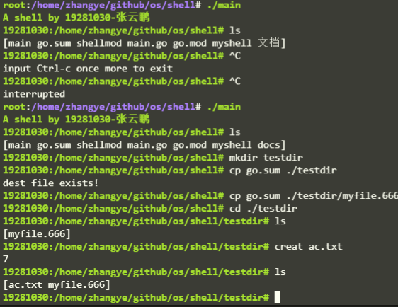

# Linux 命令解释程序设计与实现

## 实验环境
- Ubuntu 20.04 LTS
- go 1.17.8

## 测试命令
```shell
    git clone git@github.com:bruce2233/os.git && ./os/shell/main
```
## 实验结果


## 命令行提示符
1. 系统调用Getcwd()返回读取字节数n
```go
   n, _ := syscall.Getcwd(cwd)
```
2. 截取切片返回string
```go
    cwdstr := string(cwd[0 : n-1])
```

## 内部命令

### ls命令
1. 系统调用Open()返回文件描述符
```go
	fd, err = syscall.Open(myPath, syscall.O_RDONLY, 0)
```
2. 系统调用ReadDirent(),读取文件夹数据到buf
```go
	direntBytes := make([]byte, bufSize)
	syscall.ReadDirent(fd, direntBytes)
```
3. 解析Dirent结构体数据， 返回目录下的文件名string数组
```go
    syscall.ParseDirent(direntBytes, 100, fileNames)
```
### cd命令
1. 系统调用Chdir(), 切换工作目录
```go
err := syscall.Chdir(c.Args.String("cdpath"))
```
2. 更新prompt提示，系统调用Getcwd()
```go
c.App.SetPrompt("19281030:" + gocall.Getcwd() + "# ")
```
### copy命令
1. 系统调用Open(), 获取源文件和目标文件的文件描述符，同时判断异常
```go
    sourcefd, err := syscall.Open(sourcePath, syscall.O_RDONLY, 0)
    destfd, err := syscall.Open(destPath, syscall.O_RDONLY, 0)
```
2. 创建缓冲区，系统调用Read().Write(),循环从源文件读取到buf，再写入到文件
```go
    for {
            p := make([]byte, 2048)
            n, _ := syscall.Read(sourcefd, p)
            syscall.Write(destfd, p[0:n])
            if n < 2048 {
                break
            }
		}
```
### mkdir命令
1. 系统调用Mkdir()
```go
    err := syscall.Mkdir(dirpath, syscall.O_WRONLY)
```
2. 异常判断输出
```go
    if err != nil {
				println("mkdir fail")
			}
```

### creat命令
1. 系统调用Creat(), 或者通过Open 创建模式打开文件。
```go
    fd, err := syscall.Creat(file, 0)
```
2. 异常判断输出
```go
    if err != nil {
		println("create file fail")
	}
```
## 外部命令
1. 系统调用Getenv(), 拼接字符串，获得文件绝对路径
```go
	path := gocall.Getenv("PATH")
```
2. 系统调用fork和exec，创建子进程后立即执行文件
```go
	pid, err = syscall.ForkExec(path+"/"+file, nil, &procAttr)
```
## 环境变量
1. 系统调用Setenv(), 设置环境变量PATH
```go
    syscall.Setenv("PATH", "/etc/mypath")
    
```
2. 获取当前用户名，设置环境变量HOME
```go
    if u.Username == "root" {
		syscall.Setenv("HOME", "/root")
	} else {
		syscall.Setenv("HOME", "/home/"+u.Username)
	}
```